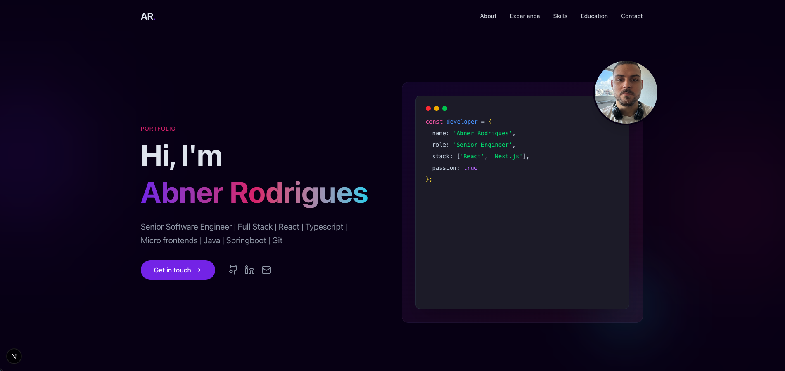
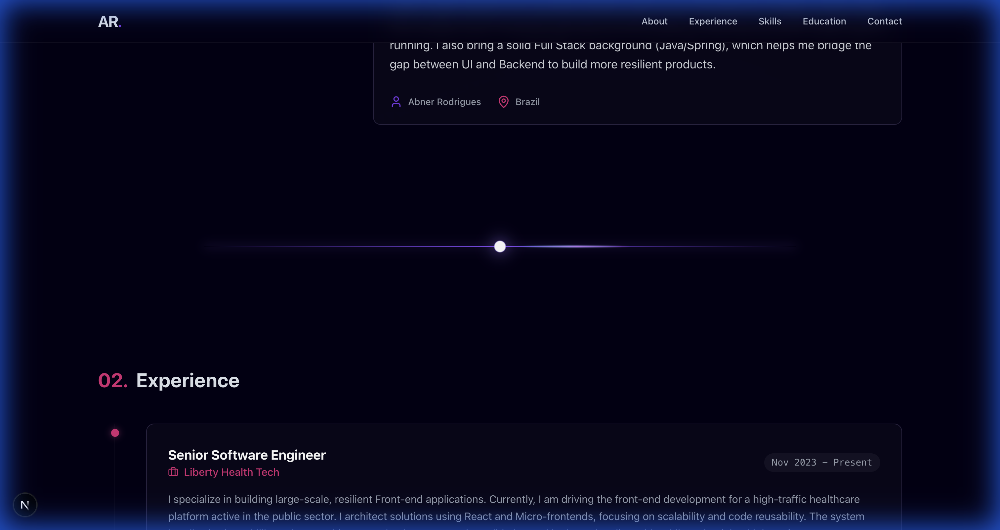

# ⚡ Abner Rodrigues | Senior Software Engineer Portfolio



> A modern, high-performance portfolio website built with **Next.js 15**, **Tailwind CSS v4**, and **Framer Motion**.  
> Designed to be **visually stunning**, **interactive**, and fully **responsive**.

## 🚀 Overview

This project serves as my personal digital showcase. It moves beyond a standard resume by incorporating dynamic animations, a "terminal-style" hero section, and electric divider effects to reflect my passion for modern frontend engineering.

## ✨ Key Features

- **🎨 Modern Dark Aesthetic**: Custom color palette with "Violet" and "Pink" electric accents against a deep background.
- **⚡ Electric Dividers**: Custom-built divider components with pulsing cores, shockwaves, and high-speed particle effects.
- **🖥️ Interactive Terminal Hero**: A creative "code snippet" representation of my profile with a floating, animated avatar.
- **🎞️ Smooth Animations**: Comprehensive usage of `framer-motion` for stagger interactions, scroll reveals, and hover effects.
- **📱 Fully Responsive**: Optimized layouts for mobile, tablet, and desktop devices.
- **🔌 LinkedIn Integration**: Data structure inspired by LinkedIn profile sections (Experience, Skills, Education).

## 🛠️ Tech Stack

- **Framework**: [Next.js 15](https://nextjs.org/) (App Router)
- **Styling**: [Tailwind CSS v4](https://tailwindcss.com/)
- **Animations**: [Framer Motion](https://www.framer.com/motion/)
- **Language**: [TypeScript](https://www.typescriptlang.org/)
- **Icons**: [Lucide React](https://lucide.dev/)
- **Font**: [Outfit](https://fonts.google.com/specimen/Outfit) (Google Fonts)

## 📸 Visual Tour

### Electric Section Dividers
High-energy transitions between sections to keep the user engaged.


## 🏃‍♂️ Getting Started

1.  **Clone the repository**:
    ```bash
    git clone https://github.com/AbnerRS/portfolio.git
    cd portfolio
    ```

2.  **Install dependencies**:
    ```bash
    npm install
    # or
    yarn install
    ```

3.  **Run the development server**:
    ```bash
    npm run dev
    ```

4.  **Open locally**:
    Visit [http://localhost:3000](http://localhost:3000) in your browser.

## 📄 License

This project is open source and available under the [MIT License](LICENSE).

---

Developed with ❤️ by **Abner Rodrigues**
